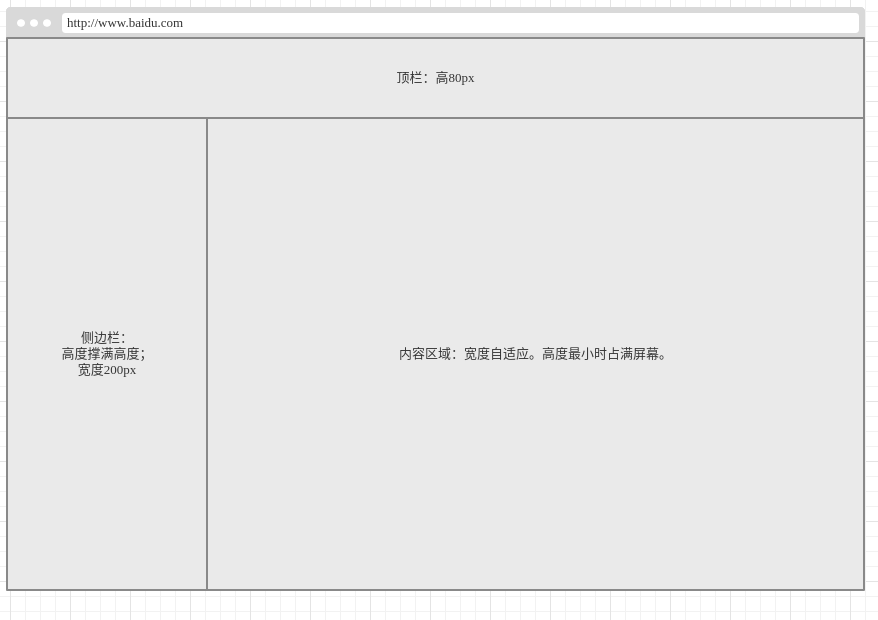
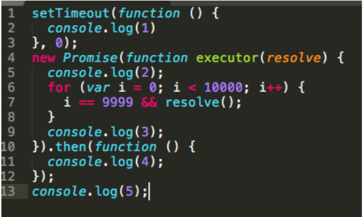

# 前端面试题

## HTML&CSS

### 样式

元素的垂直居中的几种实现。

### 布局 

如下图所示：页面的整体区域被分为以下三个区域。

* 顶栏固定高度，高度为80px。
* 顶栏下有左右两栏，左栏固定在左侧，宽度固定200px，高度撑满屏幕。
* 右侧高度与左侧相同，宽度自适应

请给出相应的HTML和CSS

## 论述题

什么是盒模型。W3C盒模型与IE盒模型的区别有哪些

简述你接触过的常用的网页性能优化的方法，列举用法

## 程序设计题

用JS实现千位分隔符，要求如下：

* 判断输入的都必须是数字或者由数字组成的字符串
* 例如：输入是10000，输出则是10,000

用JS实现对集合求交集的过程，其要求如下：

* 输入可以是1个2个或者3个参数，需要判断用户输入给出相应的方案
* 例如：输入是fun1 \(\[1, 3, 2\], \[5, 2, 1, 4\], \[2, 1\]\)，则输出是\[1, 3, 2, 5, 4\]

请写出以下代码段在浏览器控制台的打印

